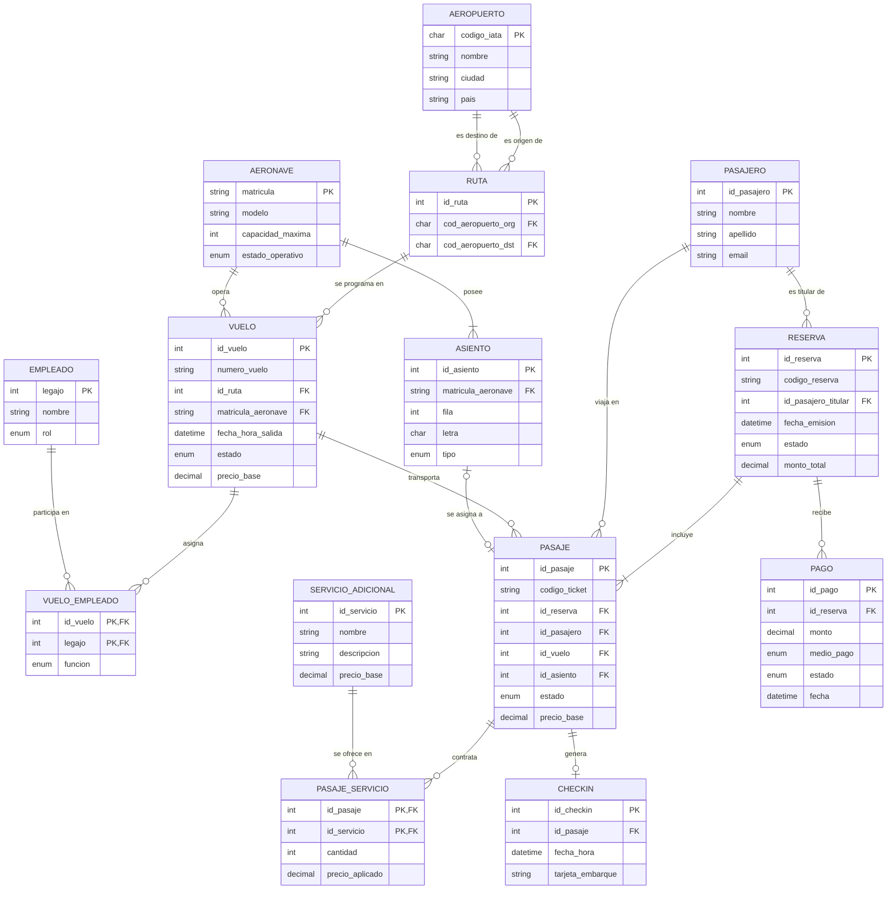

# Modelo conceptual (DER) — Aerolínea Low Cost

Diagrama Entidad-Relación del dominio. Se muestran las entidades, sus atributos
principales y las cardinalidades. Las entidades **PASAJE_SERVICIO** y
**VUELO_EMPLEADO** son asociativas (resuelven relaciones N:M con atributos).

## Cardinalidades (notación mín..máx)

| Relación | Lado A | Lado B |
|---|---|---|
| Aeropuerto–Ruta (origen) | Aeropuerto (1,1) | Ruta (0,N) |
| Aeropuerto–Ruta (destino) | Aeropuerto (1,1) | Ruta (0,N) |
| Ruta–Vuelo | Ruta (1,1) | Vuelo (0,N) |
| Aeronave–Vuelo | Aeronave (1,1) | Vuelo (0,N) |
| Aeronave–Asiento | Aeronave (1,1) | Asiento (1,N) |
| Vuelo–Empleado (asociativa) | Vuelo (0,N) | Empleado (0,N) |
| Pasajero–Reserva (titular) | Pasajero (1,1) | Reserva (0,N) |
| Reserva–Pasaje | Reserva (1,1) | Pasaje (1,N) |
| Pasajero–Pasaje | Pasajero (1,1) | Pasaje (0,N) |
| Vuelo–Pasaje | Vuelo (1,1) | Pasaje (0,N) |
| Asiento–Pasaje | Asiento (0,1) | Pasaje (0,1) |
| Pasaje–Servicio (asociativa) | Pasaje (0,N) | Servicio Adicional (0,N) |
| Pasaje–Check-in | Pasaje (1,1) | Check-in (0,1) |
| Reserva–Pago | Reserva (1,1) | Pago (0,N) |

## Observaciones de diseño

- **Ruta** conecta dos aeropuertos distintos (origen ≠ destino). Un mismo
  aeropuerto puede aparecer como origen o destino en muchas rutas, por eso hay
  dos relaciones separadas hacia `AEROPUERTO`.
- **Vuelo** requiere una aeronave asignada de forma obligatoria (1,1) para poder
  venderse; esto se modela con la FK `matricula_aeronave NOT NULL`.
- **Asiento–Pasaje** es 1:1 *dentro de un vuelo*: un pasaje puede tener 0 o 1
  asiento, y un asiento puede estar asignado a lo sumo a 1 pasaje en ese vuelo
  (se garantiza con `UNIQUE(id_vuelo, id_asiento)`).
- **Pasaje–Check-in** es 1:0..1: cada pasaje genera como máximo un check-in
  (`UNIQUE(id_pasaje)` en `CHECKIN`).
- Las entidades asociativas **PASAJE_SERVICIO** y **VUELO_EMPLEADO** llevan
  atributos propios (`cantidad`/`precio_aplicado` y `funcion` respectivamente).
